# JudgeMe - User Flows

This document contains detailed user flow diagrams using Mermaid syntax. These diagrams can be rendered in GitHub, GitLab, or any Markdown viewer that supports Mermaid.

---

## Flow 1: Admin Creates Competition

This sequence diagram shows the complete flow from admin landing on the homepage to receiving shareable URLs for judges and audience.

**Key Points:**
- No authentication required
- Admin creates competition shell (no athletes yet - that's Competition Manager's job)
- 7 tokens generated server-side with cryptographic randomness (128-bit)
- Admin receives all 7 URLs immediately for distribution
- Single judge URL is shared by all 3 judges (they select position on first load)
- Competition Manager will add athletes, groups, and flights in subsequent flows

---

## Flow 2: Judge Position Selection and Voting

This sequence diagram shows how all three judges access the same shared URL, select their positions (LEFT/CENTER/RIGHT), and vote. The CENTER position receives timer controls; LEFT/RIGHT positions get a simplified voting interface.

**Key Points:**
- **Single shared URL** for all 3 judges (reduces URL count from 8 to 7)
- **Position selection on first load**: Judges choose LEFT, CENTER, or RIGHT
- **Server-side position locking**: First-come, first-served with database transactions
- **Adaptive UI**: CENTER gets timer controls, LEFT/RIGHT get simplified interface
- **Position release**: Disabled while timer is running (safety constraint)
- **Conflict prevention**: Taken positions are greyed out for subsequent judges
- **Real-time sync**: All judges see timer countdown and lift information via WebSocket

---

## Flow 3: Venue Audience Display Updates (Simultaneous Vote Reveal)

This sequence diagram shows how the venue audience display maintains suspense by showing all 3 votes SIMULTANEOUSLY only after all judges have voted. This matches the drama of physical powerlifting judge lights.

```mermaid
sequenceDiagram
    actor Audience as Venue Audience
    participant Display as Audience Browser<br/>(Big Screen)
    participant WebSocket as Socket.IO
    participant Backend

    Audience->>Display: Open venue audience URL<br/>(projected on large screen)

    Display->>Backend: GET /audience?token=xyz789
    Backend->>Backend: Validate audience token
    Backend-->>Display: Return audience page HTML

    Display->>WebSocket: Connect to Socket.IO
    WebSocket-->>Display: Connected

    Display->>WebSocket: join_competition event<br/>{competitionId}
    WebSocket-->>Display: Joined room

    Display->>Audience: Show waiting screen<br/>"Competition Name"<br/>"Waiting for next lift..."

    Note over Backend: Admin starts lift
    WebSocket->>Display: Event: lift_started<br/>{athlete: "Alice", lift: "SQUAT", attempt: 1, weight: 100kg}

    Display->>Display: Update UI
    Display->>Audience: Show:<br/>• Athlete: ALICE (large font)<br/>• SQUAT - Attempt 1<br/>• 100 kg<br/>• 3 GREY circles (LEFT, CENTER, RIGHT)

    Note over Backend: LEFT judge votes WHITE<br/>(internal event only)
    Note over Display: ❌ Display does NOT receive vote_submitted<br/>Circles remain GREY

    Note over Backend: CENTER judge votes RED<br/>(internal event only)
    Note over Display: ❌ Display does NOT receive vote_submitted<br/>Circles remain GREY

    Note over Backend: RIGHT judge votes WHITE<br/>(internal event only)
    Note over Display: ❌ Display does NOT receive vote_submitted<br/>Circles remain GREY

    Note over Backend: All 3 votes received, result calculated
    WebSocket->>Display: Event: lift_completed<br/>{votes: [LEFT: WHITE, CENTER: RED, RIGHT: WHITE], result: GOOD_LIFT}

    Display->>Display: ALL 3 circles animate SIMULTANEOUSLY
    Display->>Audience: LEFT circle turns WHITE (300ms)<br/>CENTER circle turns RED (300ms)<br/>RIGHT circle turns WHITE (300ms)<br/>✨ SUSPENSE MAINTAINED ✨

    Display->>Display: Show result banner (after circle animation)
    Display->>Audience: Large banner appears:<br/>"GOOD LIFT"<br/>(green background)

    Note over Display: Vote lights and result banner both remain visible
    Display->>Audience: Shows both:<br/>• Vote lights (LEFT: WHITE, CENTER: RED, RIGHT: WHITE)<br/>• Result banner: "GOOD LIFT"<br/>Transparency for audience
```

**Key Points:**
- **CRITICAL:** Venue audience does NOT see individual votes as they come in
- All 3 circles remain GREY until all judges vote
- `lift_completed` event contains ALL 3 votes at once
- Circles update SIMULTANEOUSLY with synchronized animation
- Result banner appears after circles animate
- Both vote lights and result banner remain visible for transparency
- Maintains drama and suspense like physical judge lights in real powerlifting competitions
- Large, TV-optimized display (60+ feet viewing distance)

---

## Flow 4: Admin Controls Competition

This flowchart shows the decision-making process as an admin controls the competition flow from start to finish.

**Key Points:**
- Admin has full control over lift progression
- Safety checks prevent multiple simultaneous lifts
- Error correction available (reset votes, skip lifts)
- Clear visual feedback at each step

---

## Flow 5: Database State Management

This state diagram shows how lift status transitions through the competition lifecycle.

```mermaid
stateDiagram-v2
    [*] --> SessionCreated: Admin creates competition

    SessionCreated --> LiftsPending: System generates<br/>9 lifts per athlete<br/>(status: PENDING)

    LiftsPending --> LiftInProgress: Admin clicks<br/>Start Lift button

    state LiftInProgress {
        [*] --> NoVotes: Lift started
        NoVotes --> OneVote: First judge votes
        OneVote --> TwoVotes: Second judge votes
        TwoVotes --> ThreeVotes: Third judge votes
    }

    LiftInProgress --> LiftCompleted: All 3 votes received<br/>Result calculated

    LiftCompleted --> LiftsPending: More lifts<br/>remain in queue

    LiftCompleted --> AllLiftsComplete: No more lifts<br/>in queue

    AllLiftsComplete --> CompetitionEnded: Admin clicks<br/>End Competition

    CompetitionEnded --> [*]: Archived to<br/>historical dashboard

    note right of SessionCreated
        Competition status: SETUP
        Tokens generated
        Athletes created
    end note

    note right of LiftInProgress
        Lift status: IN_PROGRESS
        Vote count: 0 → 1 → 2 → 3
        Judges see lift info
    end note

    note right of LiftCompleted
        Lift status: COMPLETED
        Result: GOOD_LIFT or NO_LIFT
        Audience sees result
    end note

    note right of CompetitionEnded
        Competition status: ENDED
        End timestamp saved
        Statistics calculated
    end note
```

**Key Points:**
- Clear state transitions
- Lift voting is a sub-state
- Competition progresses linearly through lifts
- Final state triggers archival

---

## Flow 6: Error Handling - Network Reconnection

This sequence diagram shows how the system handles network interruptions gracefully.

**Key Points:**
- Automatic reconnection without user action
- State restored from server after reconnect
- Clear user feedback during disconnection
- Voting continues seamlessly after reconnect

---

## Flow 7: Happy Path - Complete Competition

This high-level flowchart shows the entire competition from creation to completion.

**Key Points:**
- Linear progression through phases
- Each lift follows identical pattern
- Clean completion with data preservation
- Ready for next competition

---

## Flow 8: Head Referee Resets Clock

This sequence diagram shows how the head referee can reset the 60-second timer when the athlete is not ready or technical issues occur.

**Key Points:**
- Head referee can reset clock at any time during countdown
- Common scenarios: athlete not ready, equipment issue, technical problem
- Timer returns to 60 seconds (or "READY" state)
- All displays synchronized immediately
- Head referee must press START again to restart countdown
- Reset count tracked in database for statistics

---

## Flow 9: Competition Manager Enters Athletes (Bulk Import)

This sequence diagram shows how the Competition Manager uses their unique URL to enter athlete data before competition day. Supports both manual entry and CSV bulk import.

```mermaid
sequenceDiagram
    actor CompMgr as Competition Manager<br/>(David)
    participant Browser
    participant Backend
    participant Database

    Note over CompMgr: Received Competition Manager URL from Admin
    CompMgr->>Browser: Open Competition Manager URL<br/>https://judgeme.app/comp-mgr?token=abc123

    Browser->>Backend: GET /comp-mgr?token=abc123
    Backend->>Database: Validate competitionManagerToken
    Database-->>Backend: Token valid, competitionId: xyz
    Backend->>Database: Fetch competition details
    Database-->>Backend: Competition: "Spring Open 2026"<br/>Status: SETUP<br/>Athletes: 0
    Backend-->>Browser: Return Competition Manager page

    Browser->>CompMgr: Show Competition Manager dashboard:<br/>• Competition: "Spring Open 2026"<br/>• Athletes: 0<br/>• "Add Athletes" button<br/>• "Import CSV" button

    Note over CompMgr: Option 1: Manual Entry (1-5 athletes)
    CompMgr->>Browser: Click "Add Athletes"
    Browser->>CompMgr: Show athlete entry form

    CompMgr->>Browser: Fill form:<br/>Name: "Alice Johnson"<br/>Weigh-in: 72.3 kg<br/>Squat opener: 100 kg<br/>Bench opener: 60 kg<br/>Deadlift opener: 120 kg
    CompMgr->>Browser: Click "Save & Add Another"

    Browser->>Backend: POST /api/competitions/:id/athletes<br/>{name, weighInWeight, squat, bench, deadlift}
    Backend->>Database: INSERT athlete record
    Database-->>Backend: Athlete created (id: 1)
    Backend-->>Browser: Success

    Browser->>CompMgr: Show confirmation<br/>"Alice Johnson added"<br/>Form cleared for next athlete

    Note over CompMgr: Repeats for Bob (athlete #2) and Charlie (athlete #3)

    Note over CompMgr: Option 2: Bulk CSV Import (20+ athletes)
    CompMgr->>Browser: Click "Import CSV"
    Browser->>CompMgr: Show file upload dialog

    CompMgr->>Browser: Select athletes.csv file<br/>(20 rows of athlete data)
    Browser->>Browser: Parse CSV client-side<br/>Validate columns

    Browser->>CompMgr: Show preview table:<br/>20 athletes parsed<br/>✅ All valid

    CompMgr->>Browser: Click "Confirm Import"

    Browser->>Backend: POST /api/competitions/:id/athletes/bulk<br/>{athletes: [20 objects]}

    Backend->>Database: BEGIN TRANSACTION
    loop For each athlete
        Backend->>Database: INSERT athlete record
    end
    Backend->>Database: COMMIT TRANSACTION

    Database-->>Backend: 20 athletes created
    Backend-->>Browser: Success: {athletesCreated: 20}

    Browser->>CompMgr: Show success message:<br/>"✅ 20 athletes imported successfully"<br/>Redirect to athlete list

    Backend->>Backend: Generate 180 lift attempts<br/>(20 athletes × 9 lifts)
    Backend->>Database: Bulk INSERT lifts (status: PENDING)
    Database-->>Backend: 180 lifts created

    Browser->>CompMgr: Display athlete list:<br/>20 athletes with openers<br/>"Ready to create groups & flights"
```

**Key Points:**
- Competition Manager has dedicated URL separate from Admin
- Two entry methods: manual form (small meets) or CSV import (large meets)
- CSV parsed client-side for instant validation feedback
- Bulk import uses database transactions for atomicity
- Opening attempts stored for each discipline (squat, bench, deadlift)
- System auto-generates 9 lift attempts per athlete (3 per discipline)
- CSV format: `name,weigh_in_weight,squat_opener,bench_opener,deadlift_opener,lot_number`

---

## Flow 10: Competition Manager Creates Groups and Flights

This sequence diagram shows how the Competition Manager organizes athletes into groups and flights using drag-and-drop interface. Follows powerlifting convention where flights are organized by weight class or experience level.

**Key Points:**
- Hierarchical structure: Competition → Groups → Flights → Athletes
- Drag-and-drop interface for intuitive athlete assignment
- Groups typically represent gender/equipment divisions
- Flights keep platforms manageable (4-10 athletes per flight)
- All athletes must be assigned before competition can start
- Admin cannot start competition until groups are finalized

---

## Flow 11: Admin Starts Flight (Group/Discipline Selection)

This sequence diagram shows how the Admin selects which group, flight, and discipline to start. This is simpler than starting individual lifts - the system handles lift progression automatically.

```mermaid
sequenceDiagram
    actor Admin as Admin<br/>(Sarah)
    participant Browser
    participant Backend
    participant Database
    participant WebSocket as Socket.IO
    participant AllDisplays as Judge/Audience/Loader Displays

    Note over Admin: Competition status: READY<br/>All athletes assigned to flights
    Admin->>Browser: Open Admin control panel

    Browser->>Backend: GET /api/competitions/:id/admin?token=adminToken
    Backend->>Database: Validate adminToken
    Database-->>Backend: Token valid
    Backend->>Database: SELECT groups with flights and athletes
    Database-->>Backend: Groups: 2, Flights: 4, Athletes: 20
    Backend-->>Browser: Return admin dashboard

    Browser->>Admin: Show admin dashboard:<br/>• Competition: "Spring Open 2026"<br/>• Status: READY<br/>• "Start Flight" button<br/>• Current Flight: None

    Admin->>Browser: Click "Start Flight"
    Browser->>Admin: Show flight selector dialog:<br/><br/>Group: [Dropdown]<br/>Flight: [Dropdown]<br/>Discipline: [Dropdown]

    Admin->>Browser: Select Group: "Group A - Women"
    Browser->>Browser: Update Flight dropdown with Group A flights

    Admin->>Browser: Select Flight: "Flight 1"
    Browser->>Browser: Load athletes in Group A → Flight 1

    Browser->>Admin: Show preview:<br/>"Group A - Women → Flight 1"<br/>Athletes: 4<br/>• Alice Johnson<br/>• Bob Smith<br/>• Charlie Lee<br/>• Diana Ross

    Admin->>Browser: Select Discipline: "SQUAT"
    Browser->>Admin: Show final confirmation:<br/>"Start SQUAT lifts for Group A - Flight 1?"<br/>(4 athletes × 3 attempts = 12 lifts)

    Admin->>Browser: Click "Start Flight"

    Browser->>Backend: POST /api/competitions/:id/start-flight<br/>{adminToken, groupId, flightId, discipline: "SQUAT"}

    Backend->>Database: Validate:<br/>- Admin token<br/>- No active flight<br/>- All athletes have openers
    Database-->>Backend: Validation passed

    Backend->>Database: UPDATE competition<br/>SET activeFlightId = f1,<br/>activeDiscipline = SQUAT,<br/>status = ACTIVE
    Database-->>Backend: Updated

    Backend->>Database: SELECT lifts WHERE flightId = f1<br/>AND liftType = SQUAT<br/>ORDER BY lotNumber, attemptNumber
    Database-->>Backend: 12 lifts (4 athletes × 3 attempts)

    Backend->>Database: UPDATE first lift<br/>SET status = IN_PROGRESS
    Database-->>Backend: Lift 1 ready

    Backend->>WebSocket: Broadcast: flight_started<br/>{groupName, flightName, discipline: SQUAT,<br/>athletes: [4], currentLift: {athlete: Alice, weight: 100kg}}

    WebSocket->>Browser: Event received
    Browser->>Admin: Show current flight panel:<br/>• Group A - Flight 1 - SQUAT<br/>• Current: Alice Johnson - 100kg<br/>• Up next: Bob Smith - 110kg<br/>• On deck: Charlie Lee - 95kg

    WebSocket->>AllDisplays: flight_started event
    AllDisplays->>AllDisplays: Update displays:<br/>• Judges: Show Alice's lift info<br/>• Head Ref: Enable clock controls<br/>• Audience: Show athlete name + weight<br/>• Loader: Show plate calculator (100kg)

    Note over Admin: Head referee starts clock<br/>Judges vote<br/>Lift completes

    Backend->>Backend: Auto-advance to next lift
    Backend->>Database: UPDATE lift (Alice attempt 1)<br/>SET status = COMPLETED
    Backend->>Database: UPDATE lift (Bob attempt 1)<br/>SET status = IN_PROGRESS

    Backend->>WebSocket: Broadcast: lift_completed + next_lift_started

    Note over Admin: Process continues through all 12 SQUAT lifts

    Admin->>Browser: When flight finishes, click "End Flight"
    Backend->>Database: UPDATE competition<br/>SET activeFlightId = NULL<br/>status = READY

    Browser->>Admin: "Flight complete. Start next flight?"
```

**Key Points:**
- Admin selects Group → Flight → Discipline (not individual lifts)
- System automatically progresses through all attempts in lifting order
- Lifting order determined by lot number (assigned during athlete entry)
- After all attempt 1s complete, system moves to attempt 2s, then 3s
- Head referee controls clock and voting for each lift
- Admin can end flight early if needed (athlete withdrawals, etc.)
- After flight ends, admin returns to flight selector for next group

---

## Flow 12: Athlete Manager Updates Attempt Weights

This sequence diagram shows how the Athlete Manager quickly updates next attempt weights during competition. Speed is critical (< 15 seconds per update).

```mermaid
sequenceDiagram
    actor AthMgr as Athlete Manager<br/>(Lisa)
    participant Browser
    participant Backend
    participant Database
    participant WebSocket as Socket.IO
    participant Displays as Loader/Announcer Displays

    Note over AthMgr: Sitting at athlete check-in table<br/>Flight 1 SQUAT in progress
    AthMgr->>Browser: Open Athlete Manager URL<br/>(already connected)

    Browser->>Backend: GET /api/competitions/:id/athlete-mgr?token=xyz
    Backend->>Database: Validate athleteManagerToken
    Database-->>Backend: Token valid
    Backend->>Database: SELECT active flight athletes
    Database-->>Backend: Flight 1 athletes (4 total)
    Backend-->>Browser: Return athlete manager page

    Browser->>AthMgr: Show athlete manager interface:<br/>• Active Flight: Group A - Flight 1<br/>• Discipline: SQUAT<br/>• Search bar (by name or lot number)<br/>• Athlete list with current/next weights

    Note over AthMgr: Alice completes attempt 1 (100kg - GOOD LIFT)<br/>Approaches check-in table

    AthMgr->>Browser: Type in search: "Alice"
    Browser->>Browser: Filter list client-side
    Browser->>AthMgr: Show filtered results:<br/>• Alice Johnson (Lot 1)<br/>  Attempt 1: 100kg ✅ GOOD LIFT<br/>  Attempt 2: [105kg] (editable)

    Note over AthMgr: Asks Alice: "What weight for attempt 2?"<br/>Alice: "107.5 kg please"

    AthMgr->>Browser: Click on "105kg" field
    Browser->>AthMgr: Field becomes editable

    AthMgr->>Browser: Change value: 105 → 107.5
    AthMgr->>Browser: Press Enter (or click Save)

    Browser->>Backend: PUT /api/athletes/:athleteId/attempts/2/weight<br/>{athleteManagerToken, weight: 107.5, discipline: SQUAT}

    Backend->>Database: Validate:<br/>- Token valid<br/>- Athlete in active flight<br/>- Weight is valid (> previous successful attempt)
    Database-->>Backend: Validation passed

    Backend->>Database: UPDATE lift<br/>SET weight = 107.5<br/>WHERE athleteId = alice AND attemptNumber = 2
    Database-->>Backend: Updated

    Backend->>WebSocket: Broadcast: attempt_weight_updated<br/>{athleteId, attemptNumber: 2, newWeight: 107.5, discipline: SQUAT}

    WebSocket->>Browser: Event received
    Browser->>AthMgr: Show confirmation:<br/>"✅ Alice attempt 2: 107.5kg"<br/>Field turns green briefly<br/>Search cleared (ready for next athlete)

    WebSocket->>Displays: attempt_weight_updated event
    Displays->>Displays: Update displays:<br/>• Loader: Recalculate plates if Alice is up next<br/>• Announcer: Update "on deck" queue<br/>• Admin: Update lift queue

    Note over AthMgr: Total time: 8 seconds ⚡
    Note over AthMgr: Bob approaches table for attempt 2 update

    AthMgr->>Browser: Type: "Bob"
    Browser->>AthMgr: Show Bob's attempts
    AthMgr->>Browser: Update attempt 2: 110 → 115kg
    Browser->>Backend: PUT /api/athletes/bob/attempts/2/weight
    Backend->>Database: UPDATE weight
    Backend->>WebSocket: Broadcast update
    Browser->>AthMgr: "✅ Bob attempt 2: 115kg"

    Note over AthMgr: Total time: 6 seconds ⚡⚡
```

**Key Points:**
- Dedicated URL for Athlete Manager (separate from Admin)
- Fast search by name or lot number (client-side filtering)
- Inline editing with instant feedback
- Real-time updates to Platform Loader and Competition Host displays
- Weight validation prevents illegal attempts (< previous successful lift)
- Optimized for speed: target < 15 seconds per athlete
- Search auto-clears after save for rapid successive updates
- Socket.IO ensures all displays stay synchronized

---

## Flow 13: Platform Loader Views Plate Loading Display

This sequence diagram shows how the Platform Loader uses the visual plate calculator to load the bar quickly and accurately. Eliminates mental math errors under pressure.

```mermaid
sequenceDiagram
    actor Loader as Platform Loader<br/>(Jake)
    participant Browser as Loader Display
    participant WebSocket as Socket.IO
    participant Backend
    participant Database

    Note over Loader: Received Platform Loader URL from Admin
    Loader->>Browser: Open Platform Loader URL<br/>https://judgeme.app/loader?token=xyz789

    Browser->>Backend: GET /loader?token=xyz789
    Backend->>Database: Validate loaderToken
    Database-->>Backend: Token valid, competitionId: xyz
    Backend->>Database: Fetch active flight
    Database-->>Backend: Flight 1 - SQUAT - 4 athletes
    Backend-->>Browser: Return loader page

    Browser->>WebSocket: Connect to Socket.IO
    WebSocket-->>Browser: Connected

    Browser->>WebSocket: join_competition event<br/>{competitionId}
    WebSocket-->>Browser: Joined room

    Note over Backend: Admin starts flight (Flight 1 - SQUAT)
    WebSocket->>Browser: Event: flight_started<br/>{currentLift: {athlete: Alice, weight: 100kg}}

    Browser->>Browser: Calculate plates for 100kg<br/>Bar: 20kg (men's bar)<br/>Weight per side: (100 - 20) / 2 = 40kg

    Browser->>Browser: Run greedy algorithm:<br/>40kg ÷ 25kg = 1 (remainder 15kg)<br/>15kg ÷ 20kg = 0 (remainder 15kg)<br/>15kg ÷ 15kg = 1 (remainder 0kg)

    Browser->>Loader: Display plate calculator:<br/><br/>🏋️ ALICE JOHNSON - SQUAT Attempt 1<br/>Total Weight: 100 kg<br/>Bar: 20 kg (Men's)<br/><br/>[RED 25kg] ×1<br/>[YELLOW 15kg] ×1<br/><br/>Visual bar diagram:<br/>|==RED==|==YELLOW==| BAR |==YELLOW==|==RED==|<br/><br/>Next up: Bob - 110kg (+10kg)

    Note over Loader: Loads plates on bar
    Loader->>Loader: Confirm: 25kg + 15kg per side ✅

    Note over Backend: Alice completes lift<br/>Next athlete: Bob - 110kg

    WebSocket->>Browser: Event: lift_completed + next_lift_started<br/>{athlete: Bob, weight: 110kg, previousWeight: 100kg}

    Browser->>Browser: Calculate weight change:<br/>110kg - 100kg = +10kg<br/>+5kg per side

    Browser->>Browser: Calculate new plates:<br/>55kg per side (110-20)/2<br/>= 25kg×2 + 5kg×1

    Browser->>Browser: Calculate difference from previous load:<br/>Previous: 25kg×1 + 15kg×1<br/>New: 25kg×2 + 5kg×1<br/>CHANGE: ADD 25kg×1, ADD 5kg×1, REMOVE 15kg×1

    Browser->>Loader: Display with change indicators:<br/><br/>🏋️ BOB SMITH - SQUAT Attempt 1<br/>Total Weight: 110 kg (+10 kg from previous)<br/>Bar: 20 kg (Men's)<br/><br/>⬆️ ADD:<br/>[RED 25kg] ×1<br/>[WHITE 5kg] ×1<br/><br/>⬇️ REMOVE:<br/>[YELLOW 15kg] ×1<br/><br/>Result:<br/>[RED 25kg] ×2<br/>[WHITE 5kg] ×1<br/><br/>Next up: Charlie - 95kg (⚠️ -15kg DECREASE)

    Note over Loader: Athlete Manager updates weight
    WebSocket->>Browser: Event: attempt_weight_updated<br/>{athleteId: bob, attemptNumber: 2, weight: 115kg}

    Browser->>Browser: Recalculate for Bob attempt 2:<br/>115kg (if Bob is next up)

    Browser->>Loader: Update preview queue:<br/>Next up: Bob attempt 2 - 115kg

    Note over Backend: Flight transitions to BENCH<br/>Women's flight starts

    WebSocket->>Browser: Event: flight_started<br/>{discipline: BENCH, athlete: Emma, weight: 50kg, bar: 15kg}

    Browser->>Loader: 🚨 BAR CHANGE ALERT 🚨<br/><br/>Switch to 15kg WOMEN'S BAR<br/><br/>EMMA WILSON - BENCH Attempt 1<br/>Total Weight: 50 kg<br/>Bar: 15 kg (Women's)<br/><br/>[GREEN 10kg] ×1<br/>[WHITE 5kg] ×1<br/>[BLACK 2.5kg] ×1

    Note over Loader: Large weight jump scenario
    WebSocket->>Browser: Event: next athlete weight 180kg<br/>(previous was 110kg)

    Browser->>Loader: ⚠️ LARGE WEIGHT CHANGE: +70kg ⚠️<br/>(Yellow warning banner)

    Note over Loader: Invalid weight scenario
    Note over Backend: Athlete requests 101.3kg<br/>(cannot load with standard plates)

    Browser->>Browser: Calculate: 40.65kg per side<br/>Greedy algorithm leaves 0.65kg remainder

    Browser->>Loader: ❌ INVALID WEIGHT: 101.3 kg<br/>Cannot load with standard IPF plates<br/>Nearest valid: 101.25 kg or 102.5 kg
```

**Key Points:**
- Visual plate calculator with color-coded IPF standard plates
  - 25kg = RED, 20kg = BLUE, 15kg = YELLOW, 10kg = GREEN, 5kg = WHITE, 2.5kg = BLACK, 1.25kg = CHROME
- Shows total weight on bar and total plate breakdown
- ADD/REMOVE indicators for weight changes (green/red highlighting)
- Alerts for large weight jumps (> 20kg)
- Bar change warnings (20kg men's → 15kg women's)
- Invalid weight detection (weights impossible with standard plates)
- "On deck" preview shows next 2-3 athletes
- Greedy algorithm minimizes total number of plates
- Real-time updates via Socket.IO when Athlete Manager changes weights

---

## Flow 14: Remote Audience Dashboard (Watching from Home)

This sequence diagram shows how remote viewers (like Grandma) access a simplified dashboard to follow competition progress from home.

**Key Points:**
- Mobile-optimized for phones and tablets (responsive design)
- No voting or control features (read-only)
- Live updates via Socket.IO (current athlete, results)
- "Up Next" queue shows next 2-3 athletes
- Recent results feed (last 5-10 lifts)
- Standings calculated in real-time
- Search functionality to find specific athlete
- Shows athlete's upcoming flights and openers
- Minimal data usage (efficient Socket.IO updates)
- No need to refresh page - all updates are live

---

## Flow 15: Competition Host Announcer Display

This sequence diagram shows how the Competition Host (announcer) uses their display to call athletes to the platform and announce results to the audience.

```mermaid
sequenceDiagram
    actor Host as Competition Host<br/>(Kilian)
    participant Browser as Announcer Display
    participant WebSocket as Socket.IO
    participant Backend
    participant Database
    participant MicSystem as PA System

    Note over Host: Received Competition Host URL from Admin
    Host->>Browser: Open URL on laptop<br/>https://judgeme.app/host?token=xyz789

    Browser->>Backend: GET /host?token=xyz789
    Backend->>Database: Validate announcerToken
    Database-->>Backend: Token valid
    Backend->>Database: Fetch active flight
    Database-->>Backend: Flight 1 - SQUAT - 4 athletes
    Backend-->>Browser: Return announcer page

    Browser->>WebSocket: Connect to Socket.IO
    WebSocket-->>Browser: Connected

    Browser->>WebSocket: join_competition event<br/>{competitionId}
    WebSocket-->>Browser: Joined room

    Note over Backend: Admin starts flight
    WebSocket->>Browser: Event: flight_started<br/>{athlete: Alice, weight: 100kg, upNext: [Bob, Charlie]}

    Browser->>Host: Display announcer view (large text):<br/><br/>🎙️ NOW ON PLATFORM:<br/>ALICE JOHNSON<br/>Lot Number: 1<br/>SQUAT - Attempt 1<br/>100 kilograms<br/><br/>🔜 ON DECK:<br/>• Bob Smith - 110 kg<br/>• Charlie Lee - 95 kg<br/>• Diana Ross - 105 kg<br/><br/>📊 Alice's Progress:<br/>Squat: Attempt 1 of 3<br/>Bench: Not started<br/>Deadlift: Not started

    Note over Host: Reads to audience over microphone
    Host->>MicSystem: "Next up, Alice Johnson,<br/>lot number 1,<br/>attempting 100 kilograms<br/>on the squat."

    Note over Backend: Head ref starts clock (60 seconds)
    WebSocket->>Browser: Event: clock_started

    Browser->>Host: Display: ⏱️ CLOCK STARTED (60s)<br/>(informational only - host doesn't announce)

    Note over Backend: Alice completes lift, judges vote
    WebSocket->>Browser: Event: lift_completed<br/>{athlete: Alice, result: GOOD_LIFT, votes: [W, W, R]}

    Browser->>Browser: Flash result animation
    Browser->>Host: Display result:<br/><br/>✅ ALICE JOHNSON<br/>100 kg - GOOD LIFT<br/>Votes: ⚪⚪🔴<br/><br/>(Large green banner, 3 second display)

    Host->>MicSystem: "Good lift for Alice Johnson,<br/>100 kilograms!"

    Note over Backend: Next athlete: Bob
    WebSocket->>Browser: Event: next_lift_started<br/>{athlete: Bob, weight: 110kg}

    Browser->>Browser: Update current + on deck
    Browser->>Host: NOW ON PLATFORM:<br/>BOB SMITH<br/>Lot Number: 2<br/>SQUAT - Attempt 1<br/>110 kilograms<br/><br/>ON DECK:<br/>• Charlie Lee - 95 kg<br/>• Diana Ross - 105 kg<br/>• Alice Johnson - 107.5 kg (Attempt 2)

    Host->>MicSystem: "Next up, Bob Smith,<br/>lot number 2,<br/>attempting 110 kilograms."

    Note over Backend: Athlete Manager updates Alice attempt 2
    WebSocket->>Browser: Event: attempt_weight_updated<br/>{athleteId: alice, attemptNumber: 2, weight: 107.5kg}

    Browser->>Browser: Update "on deck" queue
    Browser->>Host: Alice (Attempt 2): 107.5 kg updated<br/>(subtle notification - doesn't interrupt)

    Note over Backend: Large weight jump scenario
    WebSocket->>Browser: Event: next athlete 180kg<br/>(previous was 110kg, +70kg jump)

    Browser->>Host: ⚠️ LARGE WEIGHT CHANGE AHEAD ⚠️<br/><br/>Next: Diana Ross - 180 kg (+70 kg)<br/>(Yellow banner warning)

    Host->>MicSystem: "Please note, significant weight change coming.<br/>Diana Ross attempting 180 kilograms."

    Note over Backend: Flight changes (SQUAT → BENCH)
    WebSocket->>Browser: Event: flight_started<br/>{discipline: BENCH, athlete: Alice, weight: 60kg}

    Browser->>Host: 🚨 DISCIPLINE CHANGE 🚨<br/><br/>NOW STARTING: BENCH PRESS<br/><br/>First athlete: ALICE JOHNSON<br/>60 kilograms

    Host->>MicSystem: "We are now starting the bench press.<br/>First up, Alice Johnson,<br/>attempting 60 kilograms."
```

**Key Points:**
- Large, easy-to-read text optimized for quick glances (host is speaking, not reading screen continuously)
- Current athlete + "on deck" queue (next 3-4 athletes)
- Auto-updates with lift completions and weight changes
- Result display with vote breakdown (for announcer to call out)
- Athlete progress tracker (which discipline, which attempt)
- Warnings for large weight jumps (host can alert loaders/spotters)
- Discipline change alerts (SQUAT → BENCH → DEADLIFT)
- Lot number displayed (official identification)
- Real-time weight updates from Athlete Manager
- Timer status indicator (informational only)

---

## Flow Diagram Summary

| Flow | Diagram Type | Purpose | Complexity |
|------|--------------|---------|------------|
| Flow 1: Admin Creates Competition | Sequence | Competition creation with 7 URLs | Medium |
| Flow 2: Judge Voting (Side Refs) | Sequence | Side referee voting (no clock controls) | High |
| Flow 2a: Head Ref Clock & Voting | Sequence | Head referee controls timer + votes | High |
| Flow 3: Venue Audience Display | Sequence | Simultaneous vote reveal (suspense management) | Medium |
| Flow 4: Admin Controls | Flowchart | Decision-making during competition | High |
| Flow 5: Database States | State | Lift lifecycle and state transitions | Low |
| Flow 6: Network Reconnection | Sequence | Error handling and recovery | Medium |
| Flow 7: Happy Path | Flowchart | High-level complete competition | Low |
| Flow 8: Clock Reset | Sequence | Head referee resets countdown timer | Low |
| Flow 9: Competition Manager Athlete Entry | Sequence | Manual + CSV bulk import athlete data | Medium |
| Flow 10: Competition Manager Groups/Flights | Sequence | Drag-and-drop athlete organization | Medium |
| Flow 11: Admin Starts Flight | Sequence | Group/flight/discipline selection | Medium |
| Flow 12: Athlete Manager Weight Updates | Sequence | Fast inline editing (< 15 sec/athlete) | Medium |
| Flow 13: Platform Loader Plate Display | Sequence | Visual plate calculator with ADD/REMOVE indicators | High |
| Flow 14: Remote Audience Dashboard | Sequence | Mobile-optimized home viewing experience | Medium |
| Flow 15: Competition Host Announcer | Sequence | Announcer display with "on deck" queue | Medium |

---

## Viewing These Diagrams

### GitHub/GitLab
These Mermaid diagrams render automatically when viewing this file on GitHub or GitLab.

### VS Code
Install the "Markdown Preview Mermaid Support" extension to see diagrams in preview mode.

### Online Viewers
- [Mermaid Live Editor](https://mermaid.live/)
- Copy/paste diagram code to visualize and export

### Documentation Sites
- Docusaurus, MkDocs, and GitBook support Mermaid natively
