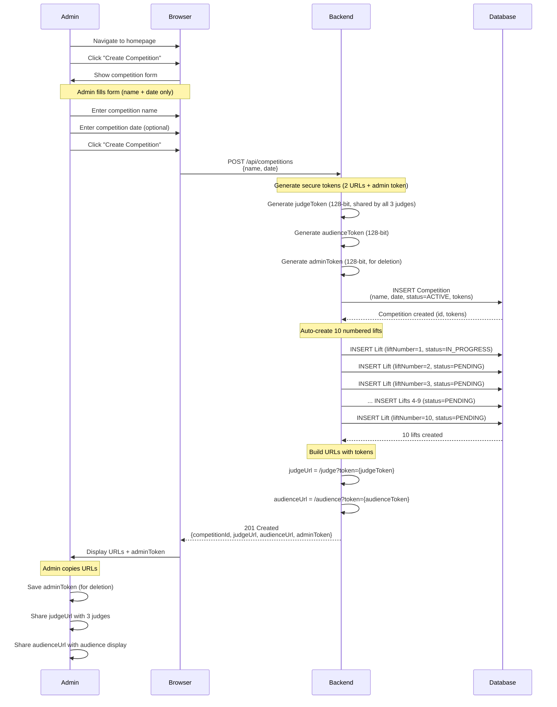
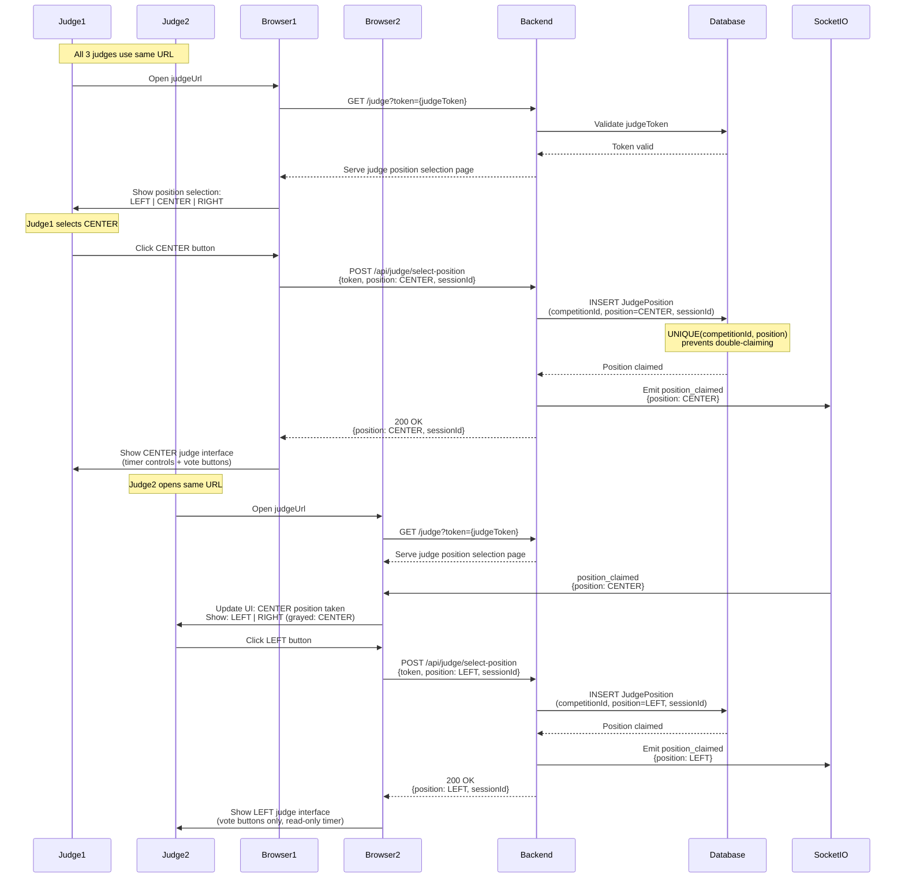
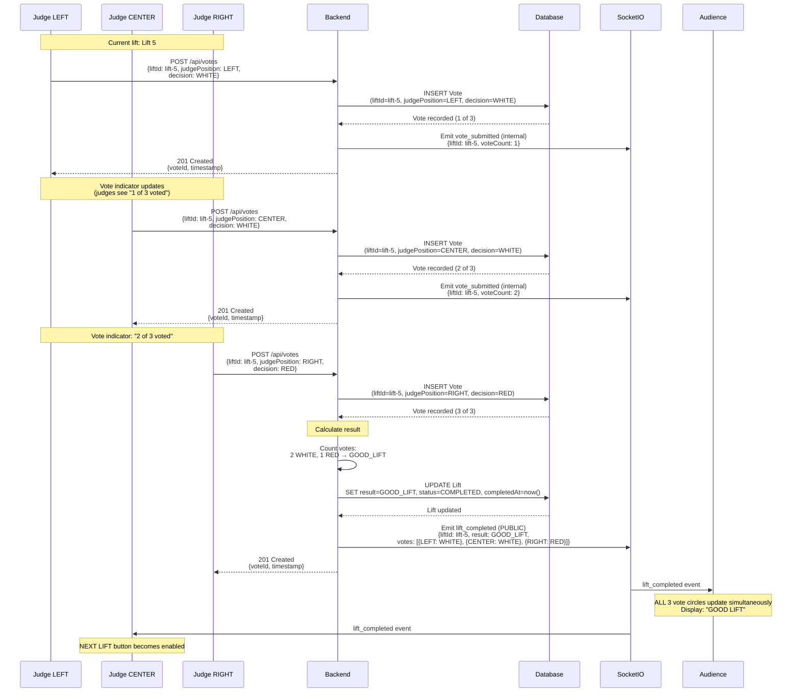
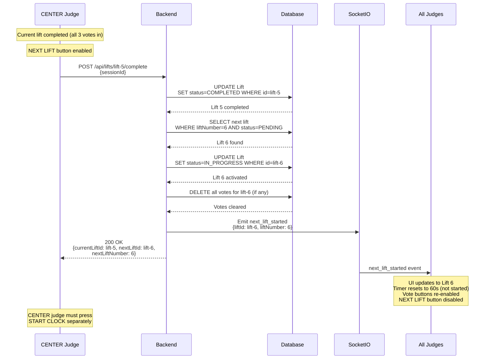
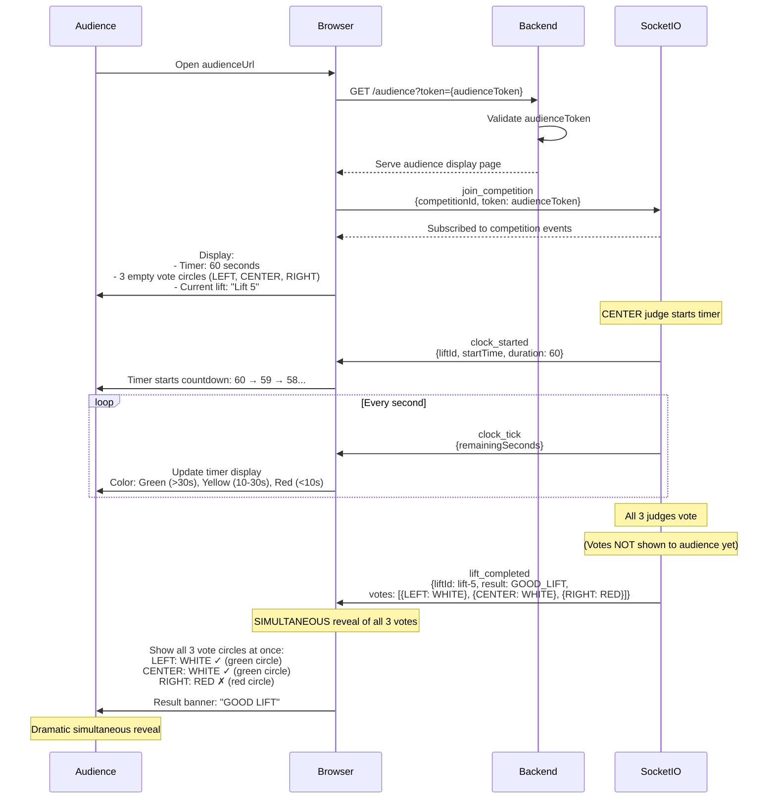
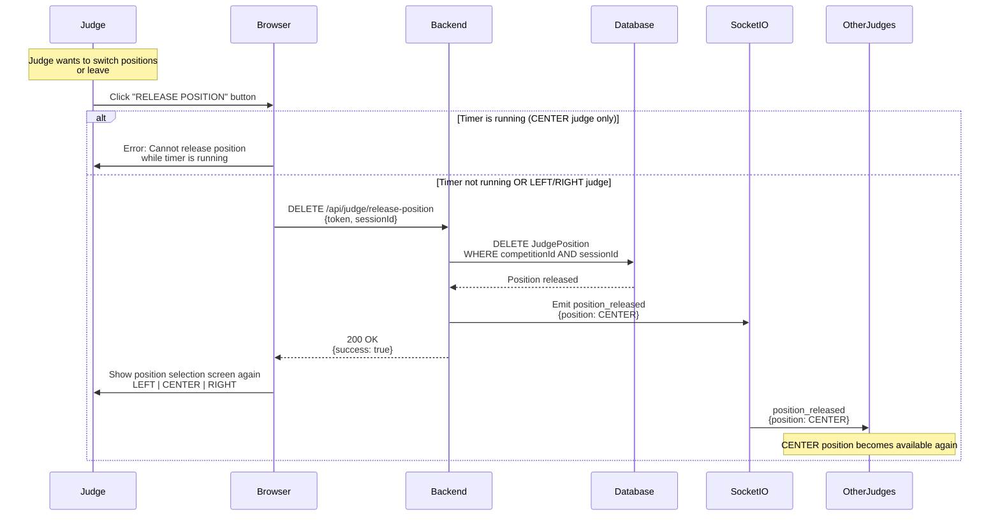
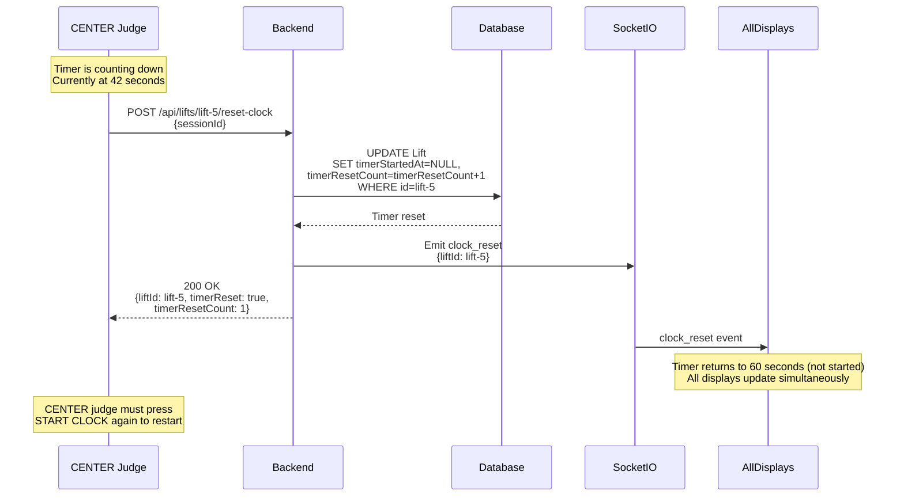
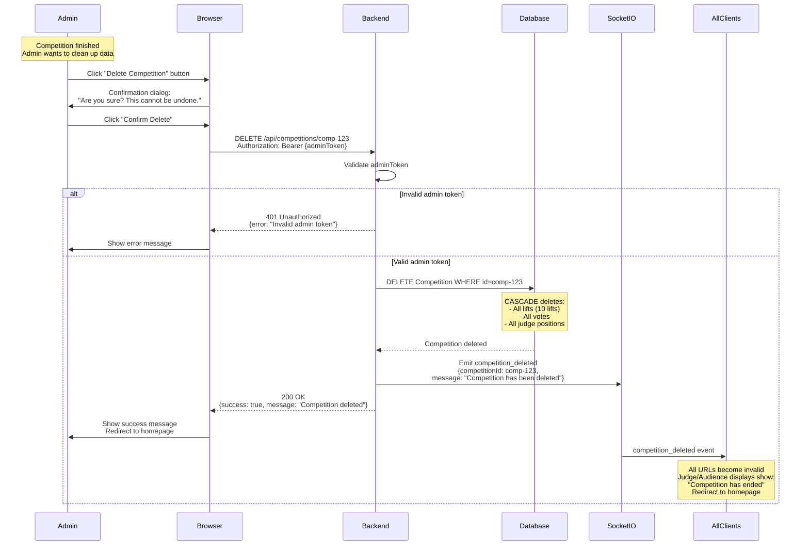

# JudgeMe MVP - User Flows

**Version:** 1.0
**Last Updated:** 2026-01-20
**Status:** MVP Specification

---

## Overview

This document contains **8 Mermaid sequence diagrams** showing the visual workflows for all MVP features. These flows focus exclusively on judge voting mechanics with **NO athlete data management**.

**MVP Scope:** Pure judging interface test system
- Judges vote on numbered lifts ("Lift 1", "Lift 2", "Lift 3"...)
- Timer controls (CENTER judge)
- Vote reveal (audience display)
- Admin creates/deletes competition
- Judge position selection and release

---

## Flow 1: Admin Creates Competition

**Purpose:** Admin creates a new competition and receives 2 URLs for judges and audience.

**Key Points:**
- Only name + date entered (NO athlete data)
- System auto-generates 10 lifts numbered 1-10
- First lift (liftNumber=1) set to IN_PROGRESS
- Admin receives 2 URLs + adminToken

---

## Flow 2: Judge Position Selection

**Purpose:** Judges use shared URL to select their position (LEFT/CENTER/RIGHT).

**Key Points:**
- Single shared URL for all 3 judges
- Server-side UNIQUE constraint prevents conflicts
- Real-time updates via Socket.IO
- CENTER judge gets timer controls, LEFT/RIGHT get voting only

---

## Flow 3: Judge Votes on Lift

**Purpose:** Judges vote (WHITE/RED) on current lift, result calculated when all 3 votes received.

**Key Points:**
- Each judge can only vote once per lift (UNIQUE constraint)
- Votes hidden from audience until all 3 received
- Result calculated: 2-3 WHITE = GOOD_LIFT, 2-3 RED = NO_LIFT
- Simultaneous reveal maintains dramatic suspense

---

## Flow 4: CENTER Judge Advances to Next Lift

**Purpose:** CENTER judge presses NEXT LIFT button to move to next numbered lift.

**Key Points:**
- Only CENTER judge can advance to next lift
- Button enabled only after all 3 votes received
- Timer resets to 60 seconds (not automatically started)
- All judge interfaces update via Socket.IO

---

## Flow 5: Audience Display Updates (Simultaneous Vote Reveal)

**Purpose:** Audience views timer and vote results with simultaneous reveal.

**Key Points:**
- Audience sees timer countdown with color-coding
- Individual votes hidden until all 3 received
- ALL 3 vote circles appear simultaneously
- Result banner shown: "GOOD LIFT" or "NO LIFT"

---

## Flow 6: Judge Releases Position

**Purpose:** Judge releases their position so another judge can claim it.

**Key Points:**
- CENTER judge cannot release while timer running
- LEFT/RIGHT judges can release anytime
- Position becomes available for other judges
- Real-time updates via Socket.IO

---

## Flow 7: CENTER Judge Resets Clock

**Purpose:** CENTER judge resets timer to 60 seconds.

**Key Points:**
- Only CENTER judge can reset timer
- Timer returns to 60 seconds (not started)
- timerResetCount incremented (for statistics)
- CENTER judge must press START CLOCK to restart

---

## Flow 8: Admin Deletes Competition

**Purpose:** Admin manually deletes competition and all related data.

**Key Points:**
- Requires valid adminToken (128-bit entropy)
- CASCADE deletes all related data (lifts, votes, positions)
- Tokens become invalid immediately
- Socket.IO notifies all connected clients

---

## Summary

The MVP includes **8 comprehensive user flows** covering:

1. ✅ **Admin Creates Competition** - Generates 2 URLs, auto-creates 10 numbered lifts
2. ✅ **Judge Position Selection** - Shared URL with server-side position locking
3. ✅ **Judge Votes on Lift** - Vote submission with simultaneous reveal
4. ✅ **CENTER Judge Advances Lift** - NEXT LIFT button for lift progression
5. ✅ **Audience Display Updates** - Timer + vote reveal with dramatic suspense
6. ✅ **Judge Releases Position** - Position change capability
7. ✅ **CENTER Judge Resets Clock** - Timer reset to 60 seconds
8. ✅ **Admin Deletes Competition** - Manual deletion with CASCADE

**Not included in MVP:**
- ❌ Athlete data entry flows
- ❌ Weight update flows
- ❌ Plate loading calculator flows
- ❌ Competition Manager flows
- ❌ Remote Audience dashboard flows
- ❌ Historical statistics flows

**MVP Focus:** Pure judging interface mechanics - vote submission, timer controls, and real-time synchronization.

---

## Viewing These Diagrams

### GitHub
Mermaid diagrams render automatically in GitHub README and markdown files.

### VS Code
Install the "Markdown Preview Mermaid Support" extension to see diagrams in preview mode.

### Online Viewers
- [Mermaid Live Editor](https://mermaid.live/)
- Copy/paste diagram code to visualize and export

---

**Last Updated:** 2026-01-20
**Status:** MVP Specification Complete
